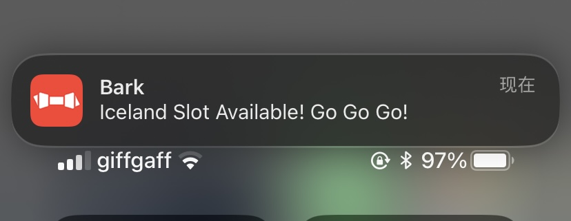

# vfs-iceland-slot-monitor
🤖️ Used to monitor the availability of Slots for Iceland on the UK VFS visa page: https://visa.vfsglobal.com/gbr/en/isl

### Requirements
`automa`, a browser extension for browser automation: https://www.automa.site/

### Technical analysis
Would not use http requests or Selenium webDriver methods. Because it is too heavy, waste life and would be blocked by Google Recaptcha V3.

### Usage
Change `vfs-iceland1.automa.json` [line 672](https://github.com/6r6/vfs-iceland-slot-monitor/blob/main/vfs-iceland1.automa.json#L672) for notice, recommended use `Bark` or `ServerChan`.

Then import to `Automa` plugin, adjust `Click Element` blocks' css selector value to your `Choose your Visa Application Centre` css value, by using Automa Element Selector.

### Notification Preview

